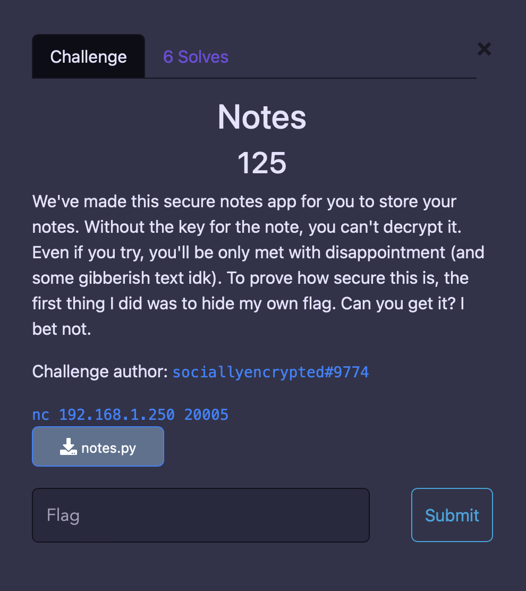
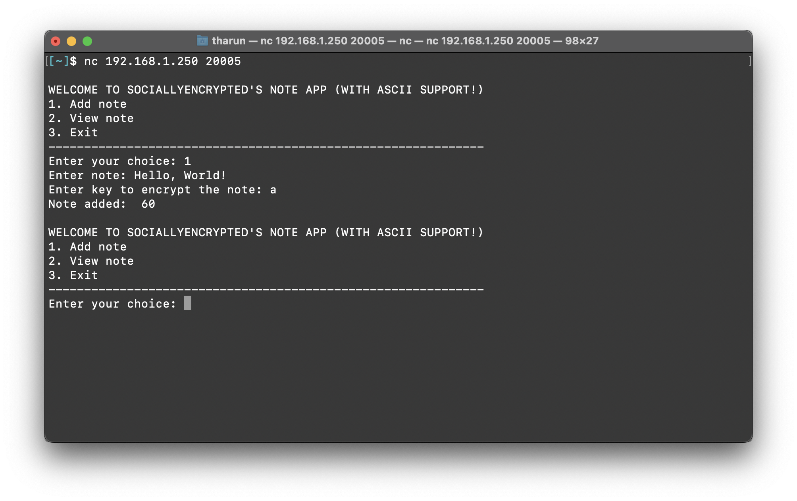
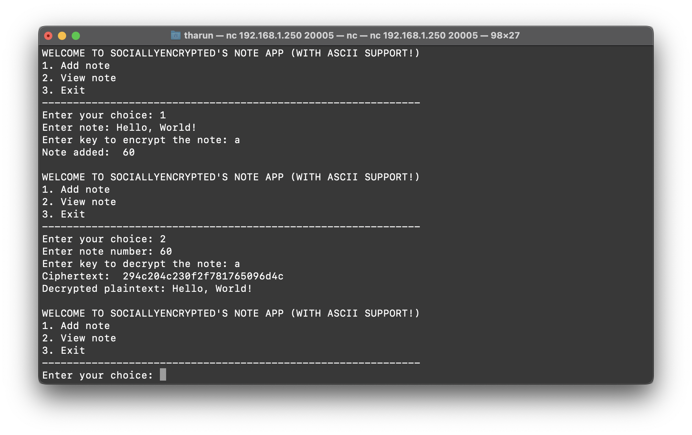
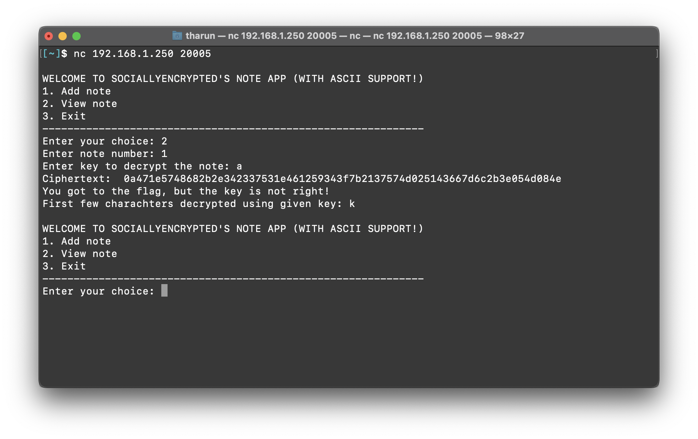
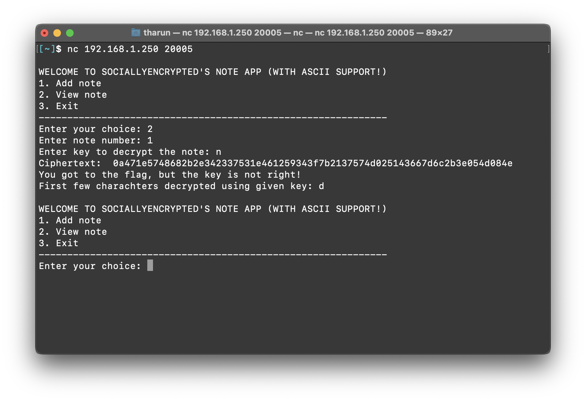
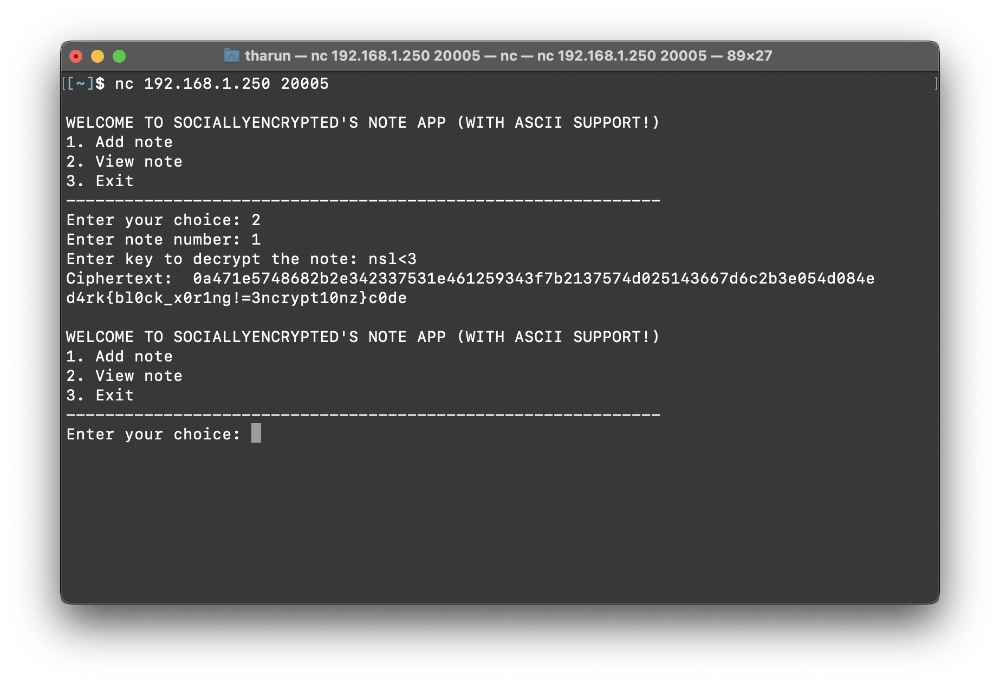

# Crypto
### Notes



##### Category
Crypto

##### Points
125 Points

##### Challenge Description
We've made this secure notes app for you to store your notes. Without the key for the note, you can't decrypt it. Even if you try, you'll be only met with disappointment (and some gibberish text idk). To prove how secure this is, the first thing I did was to hide my own flag. Can you get it? I bet not.

##### Attached Files
[notes.py](./notes.py)

##### Server
`nc 192.168.1.250 20005`

##### Explanation
Let's try to understand the python script:
```
MENU = """
WELCOME TO SOCIALLYENCRYPTED'S NOTE APP (WITH ASCII SUPPORT!)
1. Add note
2. View note
3. Exit
-------------------------------------------------------------"""

count = 0

while True:
    print(MENU)
    choice = input("Enter your choice: ")
    if choice == "1":
        text = input("Enter note: ")
        addNote(text)
    elif choice == "2":
        count = int(input("Enter note number: "))
        readNote(count)
    elif choice == "3":
        exit()
```

Here we can give 3 different inputs to the script
- "1" will let us to add a note
- "2" will let us to read a note
- "3" will exit us from the running script

When we try to add a note:



When we try to read the same note:




Let's take a deep dive into the readNote function in [notes.py](./notes.py)

```
def nexify(hexx):
    return "".join([chr(int(hexx[i : i + 2], 16)) for i in range(0, len(hexx), 2)])
```
```
def decrypt(ciphertext, key):
    block = key
    plaintext = ""
    for i in range(len(ciphertext) // len(key)):
        for j in range(len(key)):
            plaintext += chr(ord(ciphertext[i * len(key) + j]) ^ ord(block[j]))
        block = ciphertext[i * len(key) : (i + 1) * len(key)]
    return plaintext
```
```
def readNote(count):
    key = input("Enter key to decrypt the note: ")
    with open(str(count) + ".txt", "r") as f:
        ciphertext = f.read()
    print("Ciphertext: ", ciphertext)
    ciphertext = nexify(ciphertext)
    # print(len(ciphertext), len(key))
    if len(ciphertext) % len(key) == 0:
        plaintext = decrypt(ciphertext, key)
        while plaintext[-1] == "=":
            plaintext = plaintext[:-1]
        if count == 1:
            if plaintext == FLAG:
                print(FLAG)
            else:
                print("You got to the flag, but the key is not right!")
                print("First few charachters decrypted using given key:", plaintext[: len(key)])
        else:
            print("Decrypted plaintext:", plaintext)
    else:
        print("Invalid key length.")
        return
```


The readNote function takes a `count` parameter, and the file with the count number is opened. its being checked if count is equal to 1, so the flag must be in note no. 1, then the script is checking if the `len(ciphertext) % len(key) == 0` 
therefore we have to input the right key length that is divides the length of ciphertext



If we see the decrypt function it is just using XORing the ciphertext with the key
- XOR: A binary operation that takes two strings, converts them to binary, and for each corrosponding digit pair, returns 0 if both digits are 0 or 1, and returns 1 if one of the digits is 0 and the other is 1.

##### Exploitation
This can be done by XORing the given ciphertext with each charachter of the flag. (Why? Search up "Properties of XOR" on Google). Since we know the format of our flag `d4rkc0de{}` or `d4rk{}c0de`, and
from the script output of the first note we come to know the `ciphertext: 0a471e5748682b2e342337531e461259343f7b2137574d025143667d6c2b3e054d084e`, Lets start XORing.... <br>
We have to convert `0a` to bits and XOR it with the bits of `d`
Follow the ASCII chart: 


So we have:
```
int(0x0a) --> 10
bin(10)   --> 00001010
bin(d)    --> 01100100
              --------
XOR       --> 01101110 which corresponds to ASCII n
```

Sooo according to our calculation if we decrypt the note with n the first letter should come d.
Let's tryyyyy it out.



yesss! Amazing work. so now we know that the length of ciphertext is 70 so the length of the flag must be 35 since ciphertext is ascii. So we can brute force the characters XORing the ciphertext and `d4rkc0de` or `d4rk{}c0de` with the factors of 35. Let's try 5 letters next.

1st letter
```
int(0x0a) --> 10
bin(10)   --> 00001010
bin(d)    --> 01100100
              --------
XOR       --> 01101110 which corresponds to ASCII n
```

2nd letter
```
int(0x47) --> 71
bin(71)   --> 01000111
bin(4)    --> 00110100
              --------
XOR       --> 01110011 which corresponds to ASCII s
```

3rd letter
```
int(0x1e) --> 30
bin(30)   --> 00011110
bin(r)    --> 01110010
              --------
XOR       --> 01101100 which corresponds to ASCII l
```

4th letter
```
int(0x57) --> 87
bin(87)   --> 01010111
bin(k)    --> 01101011
              --------
XOR       --> 00111100 which corresponds to ASCII <
```

We are getting closeerrr!! 

Since there are 2 possible flag values `d4rkc0de` or `d4rk{}c0de` the second one make more sense since we are taking only the first 5 letters.
5th letter
```
int(0x48) --> 72
bin(72)   --> 01001000
bin({)    --> 01111011
              --------
XOR       --> 00110011 which corresponds to ASCII 3
```

And here we goood we got the key as `nsl<3`
Now read note no.1 with this key



Voila! It works!
With the key we found we are now able to decrypt the ciphertext

##### Flag
`d4rk{bl0ck_x0r1ng!=3ncrypt10nz}c0de`