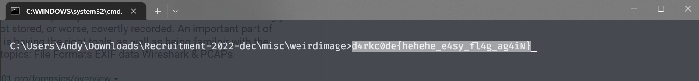

# Forensics
### data ⊄ data + more data
---
##### Category
Forensics
##### Points
146 Points
##### Challenge Description
What if you delete more data?
##### Attached Files
[photu.png](./photu.png)
##### Explanation
There is a file [photu.png](./photu.png). We have to find the flag in the photo.


##### WorkFlow
Since the Challenge description talks about the data, we will try to first
```
cat photu.png
```
Lots of non-readable texts are returned.
The flag might be hidden in this so we can use the **grep** command to match a particular string
Since we know that the ctf flag starts with **d4rkc0de** we can match this string.

```
cat photu.png | grep "d4rkc0de"
```

Nooo Resultss !!!! That means the flag is not here.
Now we can use the **strings** command to filter all the printable characters of the image.

```
strings photu.png
```

when we go through the text hoorayy!! we can find 2 text asking to delete that. look at the pics attached below.


```
LC_ALL=C sed 's/maybe_you_should_delete_this_text_too//' photu.png > a.png
```
```
LC_ALL=C sed 's/maybe_you_should_delete_this_text//' a.png > b.png
```


Then now if you open b.png yaaayyyy!! 
we got the flag in the png file



##### Flag
```
d4rkc0de{hehehe_e4sy_fl4g_ag4iN}
```
