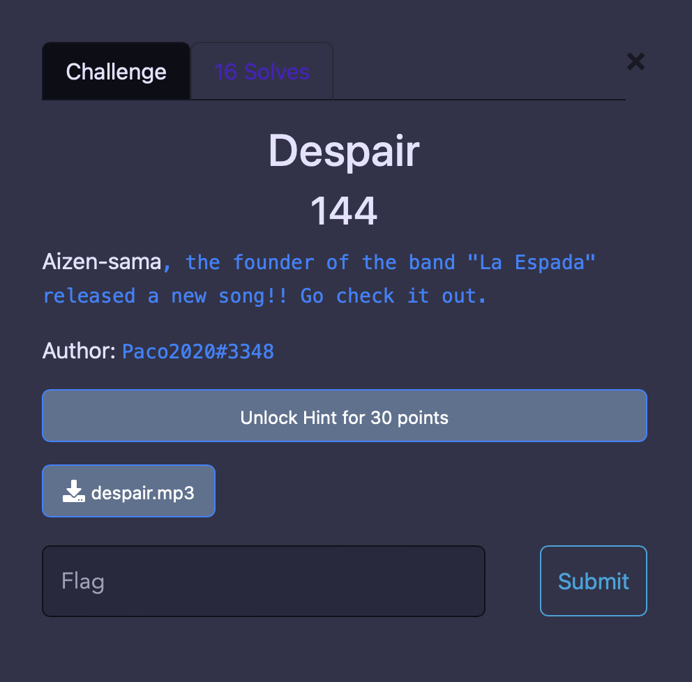
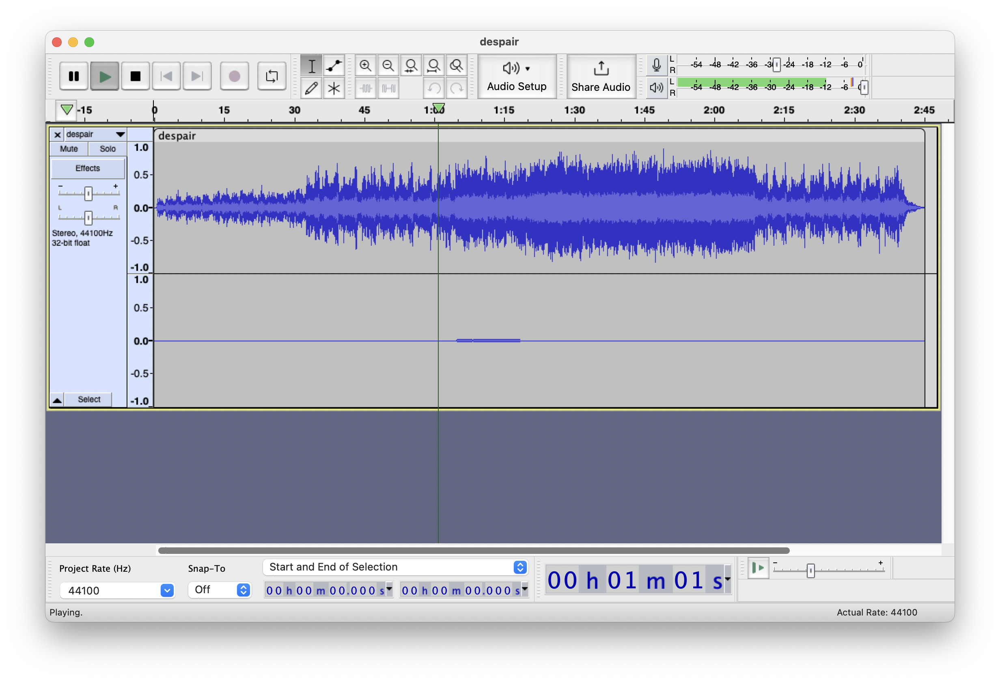
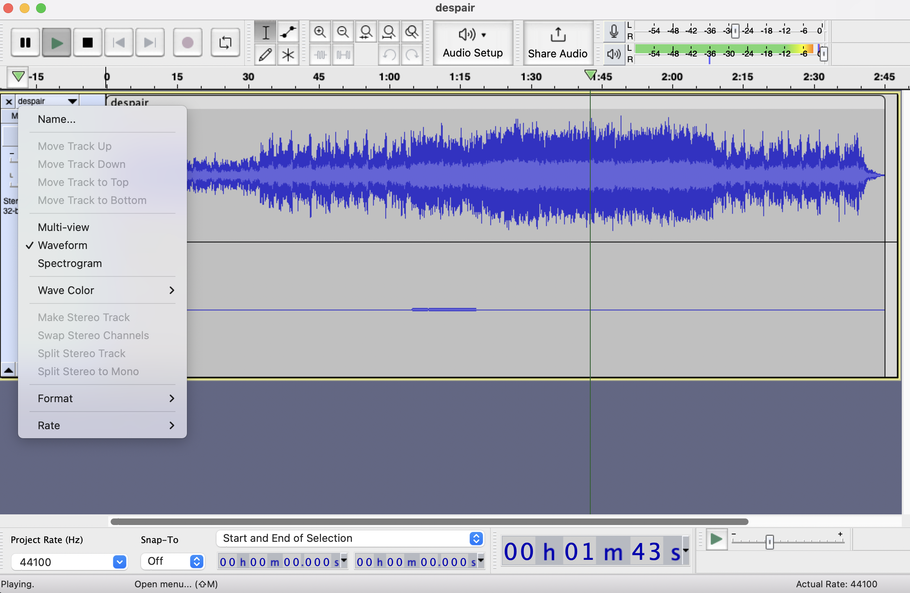
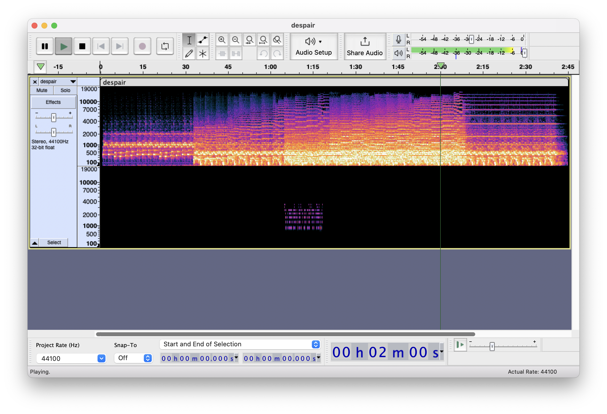
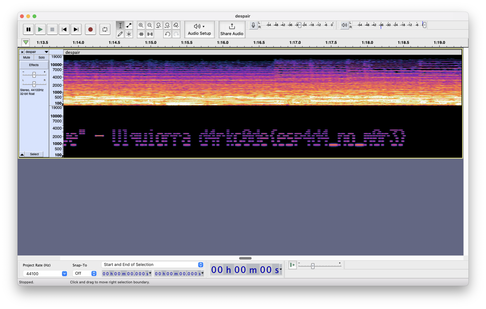

# Misc
### Despair



#### Category
Misc
#### Points
144 Points
#### Challenge Description
Aizen-sama, the founder of the band "La Espada" released a new song!! Go check it out.
#### Attached Files
[despair.mp3](./despair.mp3)
#### Explanation
There is an audio file [despair.mp2](./despair.mp3). We have to find the flag in the audio. 
Open the audio in an audio editor, I have used Audacity here



#### WorkFlow
In this audio form we can see the main music is on the top and there is a slight noise at the bottom!!
Looks interesting !!! <br>
Let's open this audio in spectrogram mode
Follow the steps to do that



If we choose the spectrogram option as shown in the above picture we get the following visual representation



Woahh !! we found something, Lets try to zoom in to that bottom noise area




Its written
```
"Those who know despair once knew hope... Those who know loss once knew love - Ulquiorra d4rkc0de
{esp4d4_no_m0r3}
```
Yayyy!! we found the flag as the visual representation of the audio form

#### Flag
`d4rkc0de{esp4d4_no_m0r3}`
